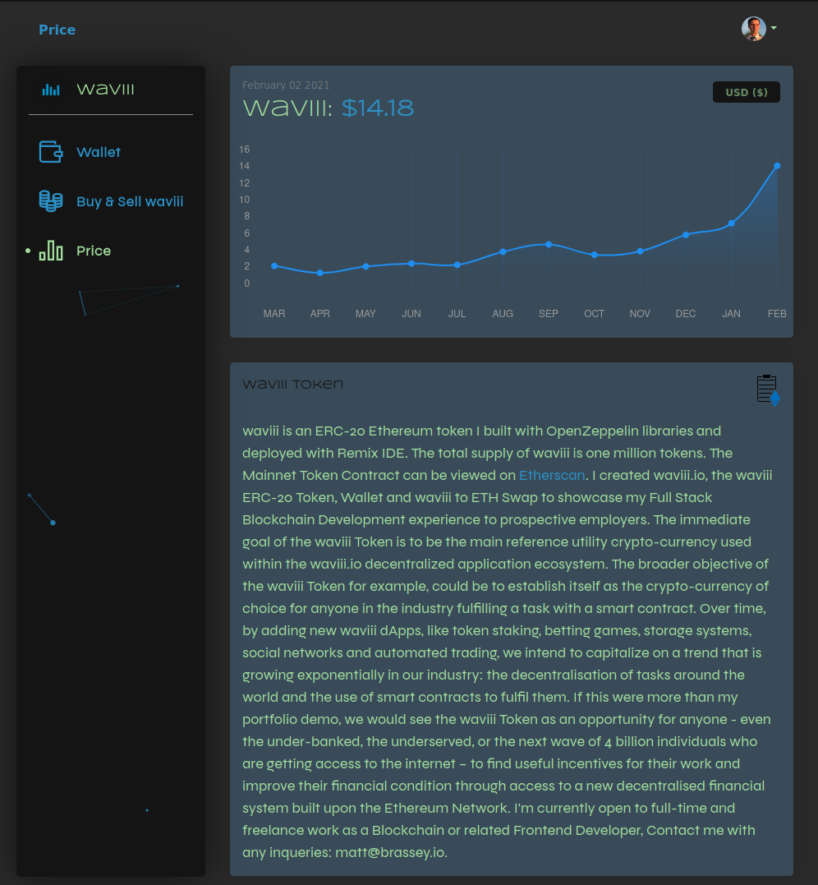
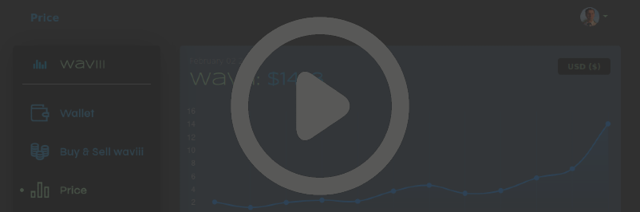
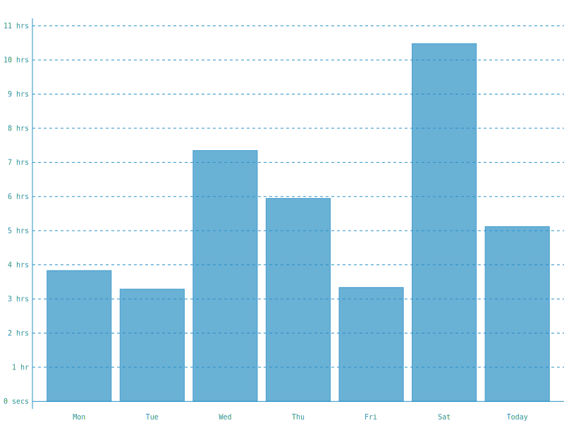

## waviii.io

Fully Decentralized ERC-20 Token, Wallet, Exchange & Price Chart. React frontend with direct MetaMask / Web3 integration, Solidity Smartcontracts deployed to Ethereum Mainnet, and a live price chart driven by the public CoinGecko API. I set out to build my own real-world cryptocurrency, wallet and exchange and **so it is**.

[](https://github.com/MBrassey/waviii.io/blob/main/LICENSE)
[](https://wakatime.com/@532855a8-3081-4600-a53d-4262beb65d14/projects/vnkbpbfjis?start=2021-01-24&end=2021-02-02)

#### Original Issues (2021)

- [x] [Setup Initial App](https://github.com/MBrassey/waviii.io/issues/1)
- [x] [Style, React Animations & Update Text Data](https://github.com/MBrassey/waviii.io/issues/2)
- [x] [Fetch & Display waviii Price / Minify SCSS](https://github.com/MBrassey/waviii.io/issues/3)
- [x] [Re-factor & Fetch waviii Price and Chart Data Directly](https://github.com/MBrassey/waviii.io/issues/4)
- [x] [Stylize, IPFS Routing & Handle Errors](https://github.com/MBrassey/waviii.io/issues/5)
- [x] [Media Queries / Locked Views](https://github.com/MBrassey/waviii.io/issues/6)
- [x] [Unit Test, Create Readme & Deploy](https://github.com/MBrassey/waviii.io/issues/7)

#### Table of Contents

- [SmartContracts](#SmartContracts)
- [Architecture](#Architecture)
- [Deployment](#Deployment)
- [CoinGecko](#CoinGecko)
- [Requirements](#Requirements)
- [Installation](#Installation)
- [Usage](#Usage)
- [Demo](#Demo)
- [Questions](#Questions)
- [License](#License)

> Application Preview
> [](https://waviii.io/)

#### SmartContracts

waviii.io's main components consist of two Smartcontracts and a Web3 ERC-20 Token wallet built into the frontend. Both Smartcontracts are deployed to the Ethereum Mainnet blockchain.

1. The first is the waviii ERC-20 Token itself. The total supply of waviii is one million tokens and the contract is designed so that tokens can only be minted via the Token Swap. The live Token Smartcontract can be viewed on [Etherscan](https://etherscan.io/token/0x9cc6754d16b98a32ec9137df6453ba84597b9965) and its Source Code on [GitHub](https://github.com/MBrassey/waviii-token).

2. The second contract is the Token Swap, the single source for buying and selling the waviii token in exchange for ETH at a fixed 1/100 rate. Because waviii can only be minted through this swap, every waviii in circulation is redeemable for exactly 0.01 ETH — the peg is enforced by the contract design itself. The live Token Swap Smartcontract can be viewed on [Etherscan](https://etherscan.io/address/0x38abf018ea2f8066813c376a197b6df0349d86c5) and its Source Code on [GitHub](https://github.com/MBrassey/waviii-swap).

3. The Web3 ERC-20 Token Wallet for the waviii Ethereum Token lives inside this repo at `src/views/wallet.js`, built directly against the deployed Token contract with MetaMask integration for balance, transfer, and activity history.

#### Architecture

A single `WalletProvider` React Context (`src/providers/WalletProvider.js`) owns the web3 instance, connected account, chain id, contract handles, and the transaction state machine. Every view and the top navbar consume it through the `useWallet()` hook — one source of truth, one set of listeners, no per-page re-bootstrapping on navigation. Account and chain changes auto-propagate. MetaMask interaction is EIP-1193 compliant (`eth_requestAccounts`, `wallet_switchEthereumChain`).

- **Price** — dashboard with CoinGecko-backed price chart (~90 daily data points, 7D/1M/3M toggle) and 4-stat header (price, 24h change, 30d high/low). 5-minute `localStorage` cache avoids re-querying CoinGecko on every mount.
- **Wallet** — balance hero, send form with validation, and an activity table that pulls `Transfer` events from the last ~200k blocks with IN/OUT pills and direct Etherscan tx links.
- **Buy & Sell** — unified swap card with flip button, Max, approve → sell state machine, pending-tx Etherscan link, and chain guard that prompts a Mainnet switch when the user is on the wrong network.

Typography pairs Syncopate (display) with JetBrains Mono (numerics, addresses, hashes). Single stylesheet at `src/assets/css/styles.css`.

#### Deployment

waviii.io is deployed to Vercel. The frontend is statically built by CRA and served from Vercel's edge; all blockchain state is read directly from the user's MetaMask provider, and the smart contracts remain on Ethereum Mainnet. No central server is required for app state — the site is fully usable from any CRA-compatible static host.

- [x] [waviii on Vercel](https://waviii.io/) (primary)

#### CoinGecko

The price chart pulls from CoinGecko's public v3 API with no API key. Raw ETH/USD candles are fetched once (`days=90, interval=daily`), cached in `localStorage` for 5 minutes, and converted to waviii/USD inline via the fixed peg (`waviiiUsd = ethUsd / 100`).

```js
// src/utils/prices.js
const COINGECKO =
  "https://api.coingecko.com/api/v3/coins/ethereum/market_chart";

export async function fetchMarketChart() {
  const cached = readCache();
  if (cached) return cached;
  const { data } = await axios.get(COINGECKO, {
    params: { vs_currency: "usd", days: 90, interval: "daily" },
  });
  writeCache(data);
  return data;
}

export const toWaviiiUsd = (ethUsd) => ethUsd / 100;
```

The Dashboard component slices the cached series by range (7D / 1M / 3M), derives summary stats (24h delta, 30d high, 30d low), and renders with `react-chartjs-2`.

#### Requirements

    node (>=14)
    npm

#### Installation

    npm i

#### Usage

    npm run start    # CRA dev server at localhost:3000
    npm run test     # jest, optional
    npm run build    # production bundle
    npm run deploy   # gh-pages publish (if using GitHub Pages)

<h6><p align="right">:cyclone: Click the image below to view the live <a id="Demo" href="https://waviii.io/">application</a></p></h6>

> Video
> [](https://youtu.be/2kR6eHG2ve8)

> Project Development Statistics
> [](https://wakatime.com/@532855a8-3081-4600-a53d-4262beb65d14/projects/vnkbpbfjis?start=2021-01-24&end=2021-02-02)

#### Questions

Contact me at [matt@brassey.io](mailto:matt@brassey.io) with any questions or comments.

#### License

`waviii.io` is published under the **CC0_1.0_Universal** license.

> The Creative Commons CC0 Public Domain Dedication waives copyright interest in a work you've created and dedicates it to the world-wide public domain. Use CC0 to opt out of copyright entirely and ensure your work has the widest reach. As with the Unlicense and typical software licenses, CC0 disclaims warranties. CC0 is very similar to the Unlicense.
