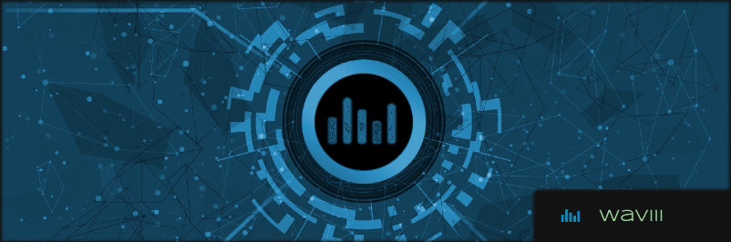
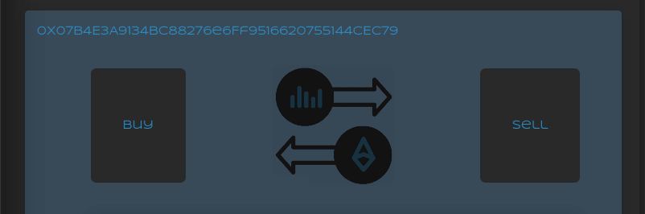

## waviii.io

Fully Decentralized ERC-20 Token, Wallet, Exchange & Price Chart. React frontend deployed to IPFS, Solidity Smartcontracts deployed to Ethereum Mainnet & Price Chart with CoinGecko RESTful API integration. Unit tested with the Jest and Truffle frameworks. I set out to build my own real-world cryptocurrency, wallet and exchange and **so it is**.

#### Issues

- [x] [Setup Initial App](https://github.com/MBrassey/waviii.io/issues/1)
- [x] [Style, React Animations & Update Text Data](https://github.com/MBrassey/waviii.io/issues/2)
- [x] [Fetch & Display waviii Price / Minify SCSS](https://github.com/MBrassey/waviii.io/issues/3)
- [x] [Re-factor & Fetch waviii Price and Chart Data Directly](https://github.com/MBrassey/waviii.io/issues/4)
- [x] [Stylize, IPFS Routing & Handle Errors](https://github.com/MBrassey/waviii.io/issues/5)
- [x] [Media Queries / Locked Views](https://github.com/MBrassey/waviii.io/issues/6)
- [x] [Unit Test, Create Readme & Deploy](https://github.com/MBrassey/waviii.io/issues/7)

#### Table of Contents

- [SmartContracts](#SmartContracts)
- [IPFS](#IPFS)
- [CoinGeko](#CoinGeko)
- [Requirements](#Requirements)
- [Installation](#Installation)
- [Usage](#Usage)
- [Demo](#Demo)
- [Questions](#Questions)
- [License](#License)

> Application Preview
> 

#### SmartContracts

waviii.io's main components consist of two Smartcontracts and a Web3 ERC-20 Token wallet. Both Smartcontracts are deployed to the Ethereum Mainnet blockchain and the wallet component can be reviewed [here](https://github.com/MBrassey/waviii-wallet). 

1. The first is the waviii ERC-20 Token itself. The live Token Smartcontract can be viewed on [Etherscan](https://etherscan.io/token/0x9cc6754d16b98a32ec9137df6453ba84597b9965) and its Source Code on [GitHub](https://github.com/MBrassey/waviii-token).

> waviii Token
> 

2. The second contract is the Token Swap, the single source for buying and selling the waviii token in exchange for ETH. Most of the one million originally minted waviii Tokens still reside on this contract, they can be traded at any time and posess real world value pegged to a fraction of ETH. The live Token Swap Smartcontract can be viewed on [Etherscan](https://etherscan.io/address/0x38abf018ea2f8066813c376a197b6df0349d86c5) and its Source Code on [GitHub](https://github.com/MBrassey/waviii-swap).

> waviii Swap
> 

#### IPFS

waviii.io's codebase is setup with continuous deployment to three platforms: Heroku, GitHub Pages and Fleek (IPFS). On Fleek, the images, text, styles and javascript are all hosted on the InterPlanetary FileSystem (IPFS) in a fully decentralized way. In connjunction with the Ethereum SmartContract backend, waviii.io is a dApp (Decentralized Application). As there is no central point of failure or central point of management, the dApp is highly redundant as well as highly censorship resistant. I have plans to deploy waviii.io as waviii.crypto to decentralize it's DNS as well thgough unstoppable domains. 

- [x] [waviii on Heroku](https://waviii.herokuapp.com/)
- [x] [waviii on Fleek (IPFS)](https://waviii.on.fleek.co/)
- [x] [waviii on GitHub Pages](https://mbrassey.github.io/waviii.io/)

#### CoinGeko

I decided to use the CoinGecko's cryptocurrency API through RapidAPI for my chart data and current waviii price. Since waviii has a 100/1 fixed exchange rate with ETH, I simply performed this calculation inline while defining the datapoints as shown below.

    getCurrentPrice = () => {
    var options = {
      method: "GET",
      url: "https://coingecko.p.rapidapi.com/simple/price",
      params: { ids: "ethereum", vs_currencies: "usd" },
      headers: {
        "x-rapidapi-key": "RAPID_API_KEY",
        "x-rapidapi-host": "coingecko.p.rapidapi.com",
      },
    };

    axios
      .request(options)
      .then((response) => {
        this.setState({ loading: true });
        const ETH = response.data.ethereum.usd;
        const raw = ETH / 100;
        const waviii = raw.toFixed(2);
        const max_num = waviii * 1.1 ;
        this.setState({ max: max_num });
        this.setState({ price: waviii });
        const month = `${moment().format("MMM")}`;
        this.setState({ month: month.toUpperCase() });
        this.setState({ loading: false });
      })
      .catch(function (error) {
        console.error(error);
      });
    };

#### Requirements

    node
    npm

#### Installation

    npm i

#### Usage

    npm run start
    npm run test (optional)
    browse: localhost:3001/

<h6>
:cyclone: Click the image(s) below to view the live <a id="Demo" href="https://waviii.io/">wabapplication</a>
</h6>

> Video
> 

> Demo
> 

> Setup
> 

> Test
> 

> Project Development Statistics
> 

#### Questions

Contact me at [matt@brassey.io](mailto:matt@brassey.io) with any questions or comments.

#### License

`waviii.io` is published under the **CC0_1.0_Universal** license.

> The Creative Commons CC0 Public Domain Dedication waives copyright interest in a work you've created and dedicates it to the world-wide public domain. Use CC0 to opt out of copyright entirely and ensure your work has the widest reach. As with the Unlicense and typical software licenses, CC0 disclaims warranties. CC0 is very similar to the Unlicense.
